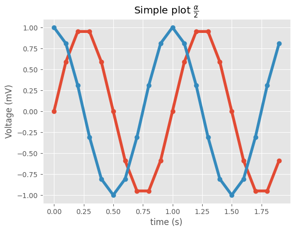
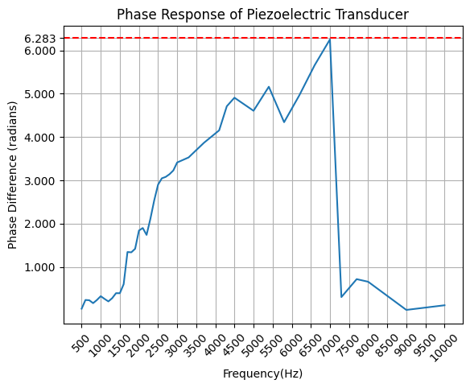
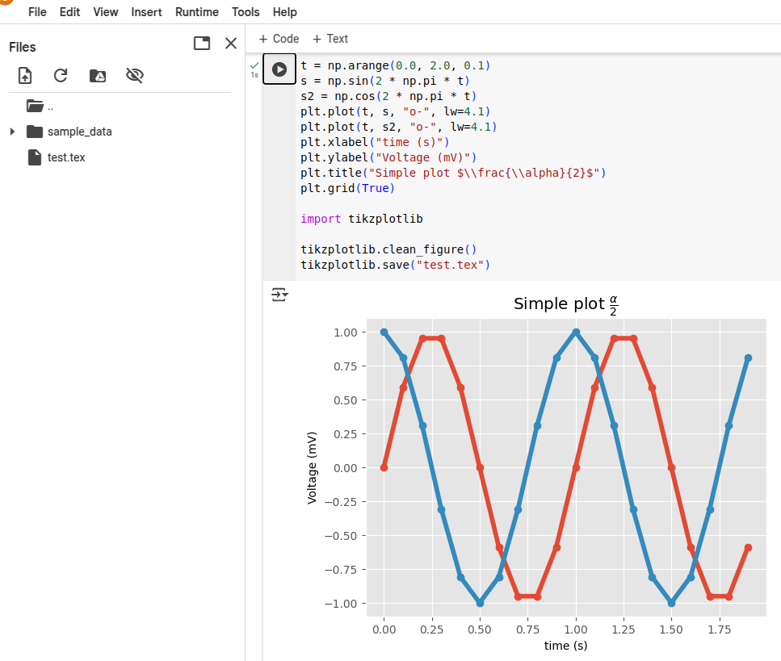
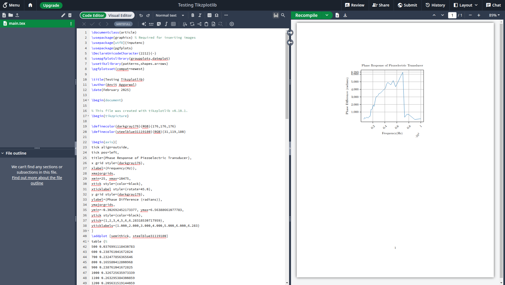

# Tikzplotlib

Hello and welcome to this blog! This blog is about the tikzplotlib library.

Matplotlib is awesome! It is so easy to plot elegant graphs and figures using matplotlib. Wouldn’t it be great if matplotlib plots can be seamlessly integrated with [LaTex](https://en.wikipedia.org/wiki/LaTeX). It would significantly improve the visual appeal and readability of the paper while also making it easier for the writer.

Now, it is possible to do it by just uploading the image. However, there are certain issues: 1. If many such plots are to be created, lots of separate files have to be uploaded and managed. 2. An image is not modifiable. For modifying the image, a new image has to uploaded each time. 3. It also integrates easily with rest of the document. Placing images at the right spot is not always easy in LaTex. And, changing the format often disturbs the positioning of the image.

## What is Tikzplotlib?

All these problems are solved by Tikzplotlib. It’s a library that converts matplotlib plots into [pgfplots](https://github.com/pgf-tikz/pgfplots/) that can be used in [LaTex](https://en.wikipedia.org/wiki/LaTeX).

Pgfplots is a LaTex package that can be used to generate scientific and technical graphics. It is based on the PGF/Tikz package developed by Till Tantau. 

What is PGF/Tikz? [PGF/Tikz](https://en.wikipedia.org/wiki/PGF/TikZ) is a pair of programming languages for producing vector graphics from a geometric/algebraic description. We are not going to delve further into PGF/Tikz. We will talk about using Tikzplotlib.

By the way, you can also watch this video:



## Installation

```python
!pip install tikzplotlib
```
That's it. Tikzplotlib is installed now.

## Running Tikzplotlib

```python
import tikzplotlib
```

```
---------------------------------------------------------------------------
ImportError                               Traceback (most recent call last)
<ipython-input-3-f7494fee2594> in <cell line: 0>()
----> 1 import tikzplotlib

2 frames
/usr/local/lib/python3.11/dist-packages/tikzplotlib/_axes.py in <module>
      1 import matplotlib as mpl
      2 import numpy as np
----> 3 from matplotlib.backends.backend_pgf import (
      4     common_texification as mpl_common_texification,
      5 )

ImportError: cannot import name 'common_texification' from 'matplotlib.backends.backend_pgf' (/usr/local/lib/python3.11/dist-packages/matplotlib/backends/backend_pgf.py)

---------------------------------------------------------------------------
NOTE: If your import is failing due to a missing package, you can
manually install dependencies using either !pip or !apt.

To view examples of installing some common dependencies, click the
"Open Examples" button below.
---------------------------------------------------------------------------
```
As you can notice here, an error is thrown when tikzplotlib is imported. This is because tikzplotlib is no longer maintained and is incompatible with the newer version of matplotlib. It calls a deprecated matplotlib function called common_texification. The solution to this is to degrade your matplotlib installation. We degraded it to 3.7 and it worked fine.

```python
!pip install matplotlib==3.7
```

On trying to run the sample code provided in the [github repository of tikzplotlib](https://github.com/nschloe/tikzplotlib), we ran into another error.

```python
import matplotlib.pyplot as plt
import numpy as np

plt.style.use("ggplot")

t = np.arange(0.0, 2.0, 0.1)
s = np.sin(2 * np.pi * t)
s2 = np.cos(2 * np.pi * t)
plt.plot(t, s, "o-", lw=4.1)
plt.plot(t, s2, "o-", lw=4.1)
plt.xlabel("time (s)")
plt.ylabel("Voltage (mV)")
plt.title("Simple plot $\\frac{\\alpha}{2}$")
plt.grid(True)

import tikzplotlib

tikzplotlib.clean_figure()
tikzplotlib.save("test.tex")
```

```
---------------------------------------------------------------------------
AttributeError                            Traceback (most recent call last)
<ipython-input-2-cae1fa5303b0> in <cell line: 0>()
     17 
     18 tikzplotlib.clean_figure()
---> 19 tikzplotlib.save("test.tex")
----------------------------------------------------------------------------

/usr/local/lib/python3.11/dist-packages/tikzplotlib/_color.py in _get_closest_colour_name(rgb)
     30     match = None
     31     mindiff = 1.0e15
---> 32     for h, name in webcolors.CSS3_HEX_TO_NAMES.items():
     33         r = int(h[1:3], 16)
     34         g = int(h[3:5], 16)

AttributeError: module 'webcolors' has no attribute 'CSS3_HEX_TO_NAMES'
```
Tikzplotlib uses a library named webcolors, the python library for HTML and CSS colour formats. Webcolors no longer has the attribute CSS3_HEX_TO_NAMES because of which this error is thrown. Just like matplotlib, webcolors also has to be degraded. We degraded it to version 1.12 and it worked fine. It can be done using:

```python
!pip install webcolors==1.12
```

On running the same code again, we get the plot:



## Key Features

Let's take a look at the key features that tikzplotlib provides.

* get_tikz_code(): It produces the LaTex code for the plot in the form of a string.

I tried to obtain the LaTex code for this graph that I had plotted for an Electrical Engineering assignment.


```python
# My code for producing matplotlib plot
plt.plot(phase_diff_df['Frequency'], phase_diff_df['Phase Difference'])
plt.axhline(y=2*np.pi, color='r', linestyle='--', label='2π Radians')
plt.xticks(range(500, 10001, 500), rotation = 45)
plt.yticks([1,2,3,4,5,6,np.pi * 2])
plt.xlabel('Frequency(Hz)')
plt.ylabel('Phase Difference (radians)')
plt.title('Phase Response of Piezoelectric Transducer')
plt.grid()
# Replace plt.show() with tikzplotlib.get_tikz_code()
tikzplotlib.get_tikz_code()
```

```
---------------------------------------------------------------------------
AttributeError                            Traceback (most recent call last)
<ipython-input-79-3f4dc8ddbdb9> in <cell line: 0>()
      7 plt.title('Phase Response of Piezoelectric Transducer')
      8 plt.grid()
----> 9 tikzplotlib.get_tikz_code()

4 frames
/usr/local/lib/python3.11/dist-packages/tikzplotlib/_path.py in mpl_linestyle2pgfplots_linestyle(data, line_style, line)
    470 
    471         # get dash format of line under test
--> 472         dashSeq = line._us_dashSeq
    473         dashOffset = line._us_dashOffset
    474 

AttributeError: 'Line2D' object has no attribute '_us_dashSeq'
```
But, it gave me the above error. I realised that the problem was because of the dashed red line. So, I commented out that part of the code. And it worked.

```LaTex
% This file was created with tikzplotlib v0.10.1.
\begin{tikzpicture}

\definecolor{darkgray176}{RGB}{176,176,176}
\definecolor{steelblue31119180}{RGB}{31,119,180}

\begin{axis}[
tick align=outside,
tick pos=left,
title={Phase Response of Piezoelectric Transducer},
x grid style={darkgray176},
xlabel={Frequency(Hz)},
xmajorgrids,
xmin=25, xmax=10475,
xtick style={color=black},
xticklabel style={rotate=45.0},
y grid style={darkgray176},
ylabel={Phase Difference (radians)},
ymajorgrids,
ymin=-0.302692452173377, ymax=6.56388661077783,
ytick style={color=black},
ytick={1,2,3,4,5,6,6.28318530717959},
yticklabels={1.000,2.000,3.000,4.000,5.000,6.000,6.283}
]
\addplot [semithick, steelblue31119180]
table {%
500 0.0376991118430783
600 0.238761041672824
700 0.232477856365646
800 0.165580412800968
900 0.238761041672825
1000 0.326725635973339
1100 0.263295384300859
1200 0.205631519144059
1300 0.280984046937071
1400 0.395840674352314
1500 0.394662577107217
1600 0.60318578948924
1700 1.34585829279787
1800 1.33831847042925
1900 1.4206281979533
2000 1.84097329500362
2100 1.90003523689111
2200 1.74044233008875
2300 2.11350645770253
2400 2.53840686410055
2500 2.89942821987558
2600 3.0473448739821
2700 3.07948578343806
2800 3.14159265358979
2900 3.22776205208826
3000 3.41176962179851
3300 3.52845734893185
3700 3.86541560097688
4100 4.1539708862091
4300 4.71015495894214
4500 4.90716772490726
5000 4.60557483016264
5400 5.16043721265302
5800 4.34179528699395
6200 4.96468303656529
6600 5.65796003692055
7000 6.25176938064369
7300 0.305781684949406
7700 0.719660337121081
8000 0.659734457253857
9000 0.00942477796076878
10000 0.116687727133336
};
\end{axis}

\end{tikzpicture}
```
* save(): This does the same job as get_tikz_code() but saves the code in a tex file instead of printing it as a string. Notice that test.tex has been created in the files section.


* clean_figure(): It reduces the number of points to create a smoother and cleaner figure. 

I tried using this function on the Piezoelectric Transducer Graph. However, there was no noticeable change.

I then used an example from the repository itself:
```python
from tikzplotlib import get_tikz_code, cleanfigure

x = np.linspace(1, 100, 20)
y = np.linspace(1, 100, 20)

with plt.rc_context(rc=RC_PARAMS):
  fig, ax = plt.subplots(1, 1, figsize=(5, 5))
  ax.plot(x, y)
  ax.set_ylim([20, 80])
  ax.set_xlim([20, 80])
  raw = get_tikz_code()

  clean_figure(fig)
  clean = get_tikz_code()

  # Use number of lines to test if it worked.
  # the baseline (raw) should have 20 points
  # the clean version (clean) should have 2 points
  # the difference in line numbers should therefore be 2
numLinesRaw = raw.count("\n")
numLinesClean = clean.count("\n")
print("number of tikz lines saved", numLinesRaw - numLinesClean)
```

Note the comments made by the author. Raw must have 20 points. The clean version should have 2 points. It matches with the output obtained. However, the author also states that the difference in line numbers should therefore be 2. But, 20 - 2 = 18 and that's the output that was obtained.

Here's the raw code:
```LaTex
% This file was created with tikzplotlib v0.10.1.
\begin{tikzpicture}

\definecolor{darkgray176}{RGB}{176,176,176}
\definecolor{steelblue31119180}{RGB}{31,119,180}

\begin{axis}[
tick align=outside,
tick pos=left,
x grid style={darkgray176},
xmin=20, xmax=80,
xtick style={color=black},
y grid style={darkgray176},
ymin=20, ymax=80,
ytick style={color=black}
]
\addplot [semithick, steelblue31119180]
table {%
1 1
6.21052631578947 6.21052631578947
11.4210526315789 11.4210526315789
16.6315789473684 16.6315789473684
21.8421052631579 21.8421052631579
27.0526315789474 27.0526315789474
32.2631578947368 32.2631578947368
37.4736842105263 37.4736842105263
42.6842105263158 42.6842105263158
47.8947368421053 47.8947368421053
53.1052631578947 53.1052631578947
58.3157894736842 58.3157894736842
63.5263157894737 63.5263157894737
68.7368421052632 68.7368421052632
73.9473684210526 73.9473684210526
79.1578947368421 79.1578947368421
84.3684210526316 84.3684210526316
89.5789473684211 89.5789473684211
94.7894736842105 94.7894736842105
100 100
};
\end{axis}

\end{tikzpicture}
```

And here's the cleaned up version:

```LaTex
% This file was created with tikzplotlib v0.10.1.
\begin{tikzpicture}

\definecolor{darkgray176}{RGB}{176,176,176}
\definecolor{steelblue31119180}{RGB}{31,119,180}

\begin{axis}[
tick align=outside,
tick pos=left,
x grid style={darkgray176},
xmin=20, xmax=80,
xtick style={color=black},
y grid style={darkgray176},
ymin=20, ymax=80,
ytick style={color=black}
]
\addplot [semithick, steelblue31119180]
table {%
16.6315784454346 16.6315784454346
84.3684234619141 84.3684234619141
};
\end{axis}

\end{tikzpicture}
```


## Integrating with LaTex

Also make sure that the packages for PGFPlots and proper Unicode support and are included in the header of your document:

```LaTex
\usepackage[utf8]{inputenc}
\usepackage{pgfplots}
\DeclareUnicodeCharacter{2212}{−}
\usepgfplotslibrary{groupplots,dateplot}
\usetikzlibrary{patterns,shapes.arrows}
\pgfplotsset{compat=newest}
```

Just paste the Tikz code produced by Tikzplotlib.



## Limitations
* Tikzplotlib is outdated. One has to degrade matplotlib and webcolors.
* There are cases (such as plotting the dashed red-line in the example) where tikzplotlib does not work. Also, it does not work when plt.legend() is used.
* Tikzplotlib does not work for [3-D plots](https://github.com/matplotlib/matplotlib/issues/7243).
* The clean_figure function did not produce accurate results.

## Conclusion

* Tikzplotlib is useful. It is definitely easier to integrate matplotlib graphs in LaTex.
* However, it is quite outdated which makes it inconvenient for users.
* Also, it has limitations. It does not work well with all features of matplotlib.

## References
* [https://github.com/nschloe/tikzplotlib](https://github.com/nschloe/tikzplotlib)
* [https://tikzplotlib.readthedocs.io/index.html](https://tikzplotlib.readthedocs.io/index.html)

